# Getting Started With AutoPalExpress

This guide shows the basic path:

1. Install AutoPalExpress.
2. Make your admin account.
3. Create or import a Palworld server.
4. Start it.
5. Let friends join.

You do not need to understand SteamCMD, config files, or Windows Firewall to start.

> [!TIP]
> This guide covers first-time setup only. For a page-by-page walkthrough of everything else in the app, see the [AutoPalExpress Wiki](https://github.com/Kvitekvist/AutoPalExpress/wiki).

## What You Need

- A Windows 10 or Windows 11 PC.
- Enough disk space for the server and backups.
- Your router login if friends will join over the internet.
- A real public IP from your internet provider.

> [!TIP]
> You do not need a Steam account to download the Palworld Dedicated Server. AutoPalExpress can download it for you.

## 1. Install The App

Download `PalworldServerAdmin-Setup.exe` from GitHub.

Run the installer.

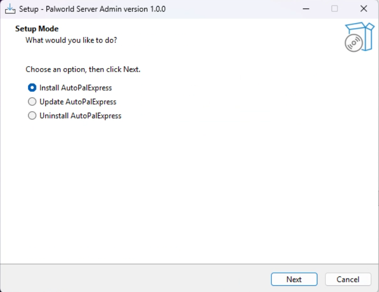

If you want the server to come back after a PC restart, turn on the Windows startup option during install.

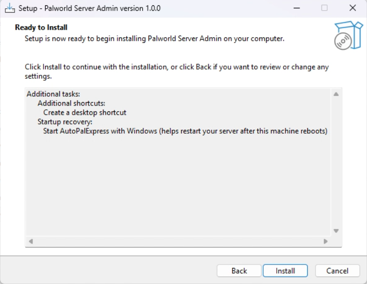

> [!NOTE]
> Running the installer again later updates the app. It keeps your server list and admin account.

Select Install Location
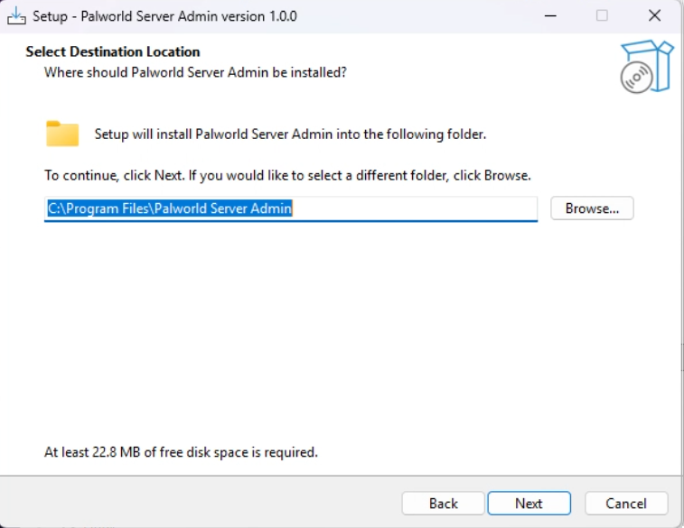

## 2. Make Your Admin Account

The first account is the main admin account.

This account can change important things like ports, server folders, mods, and startup options.

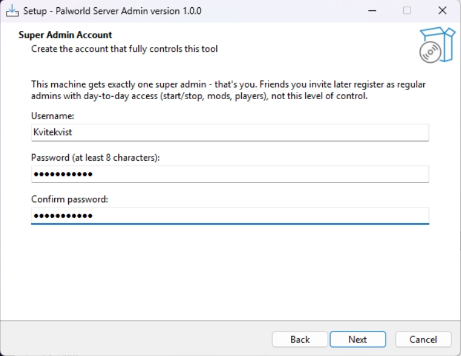

Use a password you do not share in public.

## 3. Add A Server

You have two choices:

- **Create new server** if you are starting fresh.
- **Import existing server** if you already have Palworld server files.

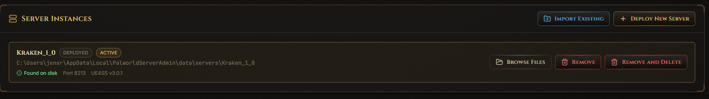

> [!TIP]
> You can put the server on another drive if your C drive is small.

## 4. Start The Server

Go to **Server Control**.

Click **Start Server**.

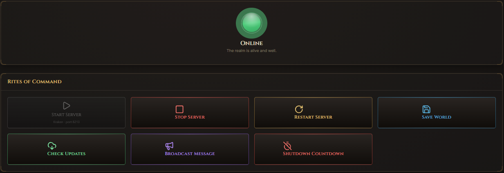

Then go to **Dashboard**.

If everything worked, it should show **Online**.

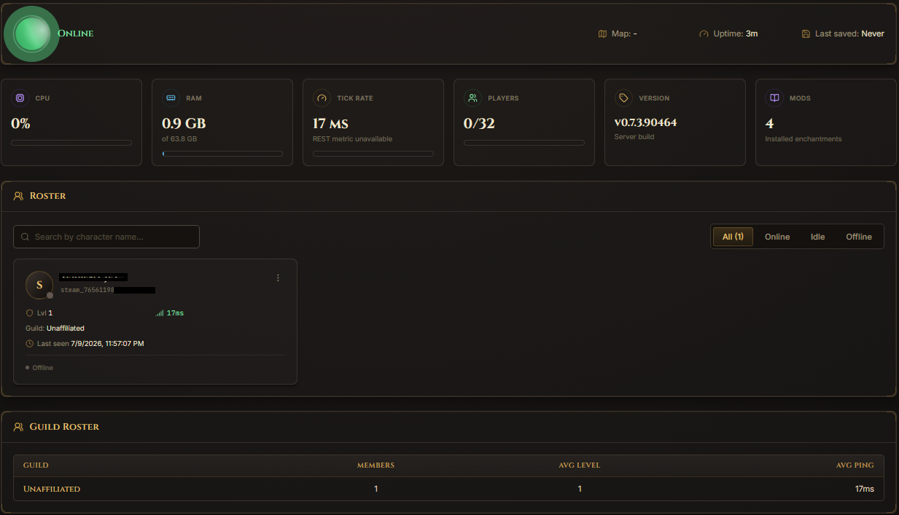

## 5. Let Friends Join

Go to **Super Admin**.

Check the **Game Port**.

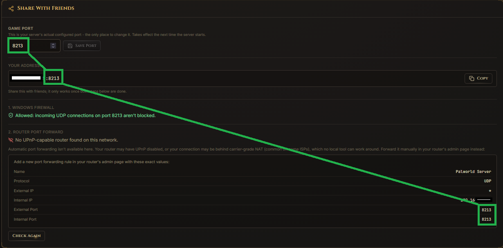

Most Palworld servers use port `8211`, but yours may be different.

In your router, forward that port as **UDP** to the PC running AutoPalExpress.

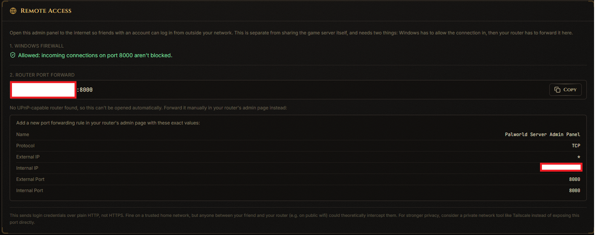

Then give friends your public IP and port.

Example:

```text
123.123.123.123:8213
```

> [!WARNING]
> Do not forward the Palworld Local API / REST API port. AutoPalExpress uses that only on your own PC.

## 6. Show The Server In Community Servers

Go to **Launcher Options**.

Turn on `-publiclobby`.

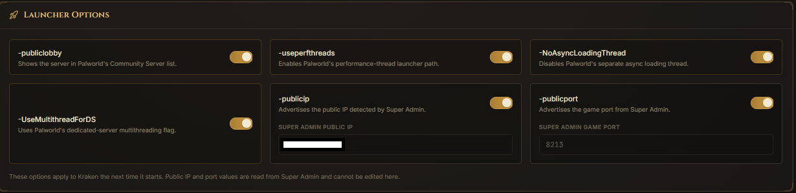

Restart the server after changing launcher options.

If direct connect works but the Community Server list does not, also try:

- `-publicip`
- `-publicport`

Those values come from Super Admin, so you do not type them on this page.

## 7. Change World Settings

Go to **World Settings**.

This is where you change things like:

- Server name
- Passwords
- Max players
- XP rate
- Day and night speed
- Pal spawn rate
- Death penalty

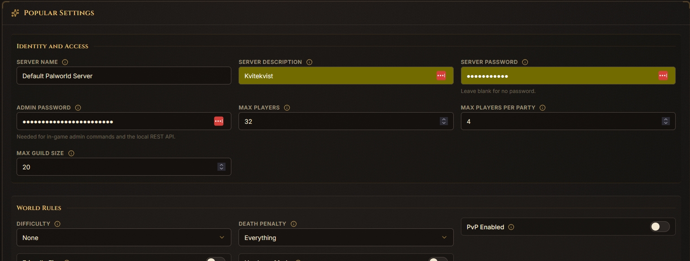

Click **Save Changes** when you are done.

Restart the server so Palworld reloads the settings.

## 8. Add Mods

Go to **Mods**.

Use this page to install UE4SS and manage mods.

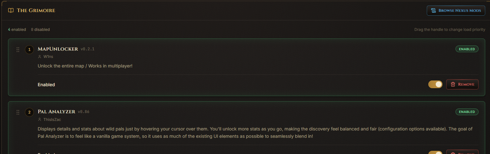

For Nexus Mods:

- You can browse mods without an API key.
- Regular admins can add mods to the server wishlist for the super admin to approve or deny.
- Direct install and wishlist approval need the super admin's saved Nexus Premium API key.
- You can also download a mod yourself and install it from file in **Super Admin**.

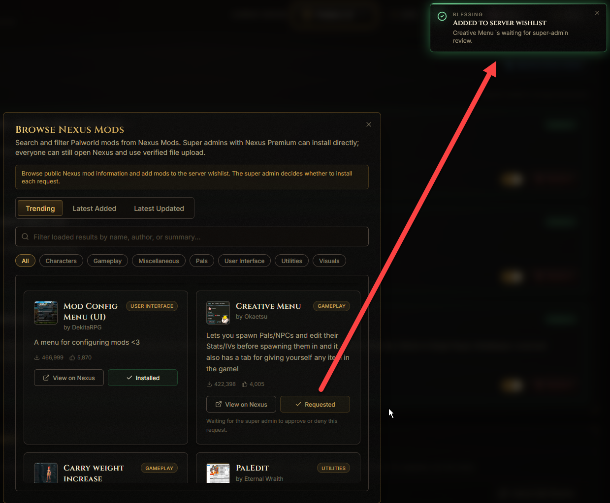

Restart the server after changing mods.

## 9. Invite Friends To Help

Go to **Settings**.

Create an invite code.

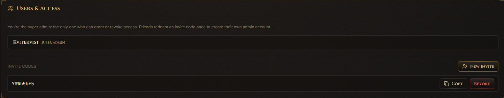

Only invite people you trust.

Regular admins can help with normal server work. The main admin still controls the more dangerous settings.

## 10. If Something Does Not Work

Use **Diagnose AutoPalExpress** from the Windows Start Menu, or click **Run Diagnostics** on the **Super Admin** page to run the same check without leaving the browser.


It checks:

- Server folder
- Game port
- Local API
- Windows Firewall
- Whether Palworld is listening

It saves a report here:

```text
%LOCALAPPDATA%\PalworldServerAdmin\diagnostics
```

Send that report when asking for help.

## Quick Fixes

**Friends cannot join**

- Make sure Dashboard says **Online**.
- Check the game port in Super Admin.
- Forward the game port as **UDP** in your router.
- Run Diagnose AutoPalExpress.
- Ask your internet provider if you are behind CGNAT.

**Server is not in Community Servers**

- First test direct connect.
- Turn on `-publiclobby`.
- Restart the server.
- Try `-publicip` and `-publicport`.
- Wait a bit. Palworld's list can be slow.

**Players are missing from the roster**

- Start the server from AutoPalExpress.
- Make sure Local API is enabled in Super Admin.
- Restart the server once.

**Mods do not load**

- Install or repair UE4SS.
- Make sure the mod is enabled.
- Make sure the mod works with your Palworld version.
- Restart the server.
