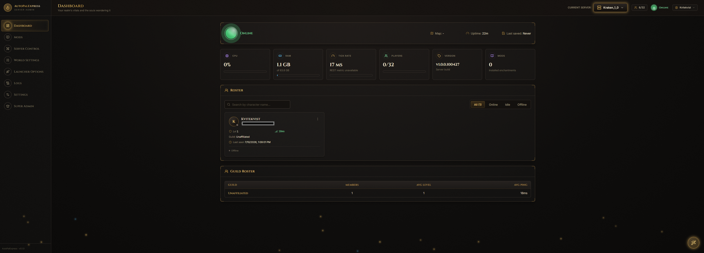
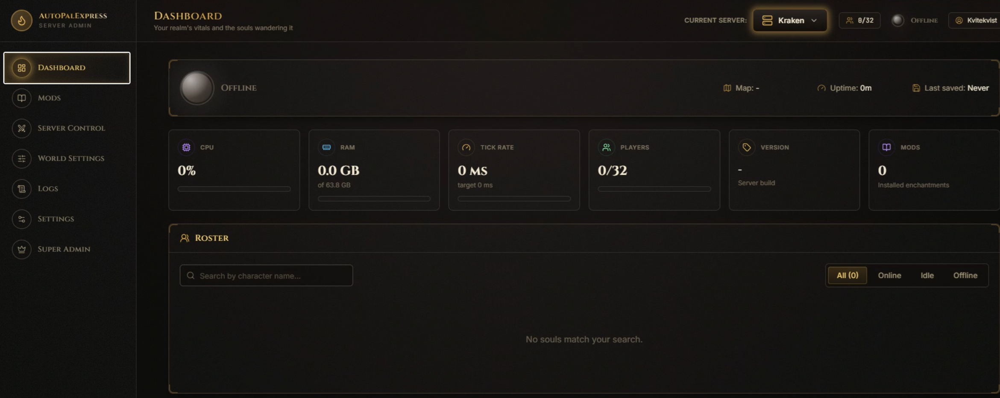
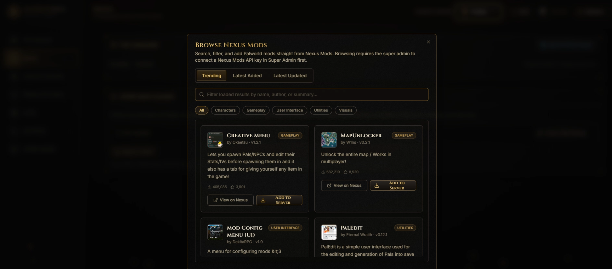
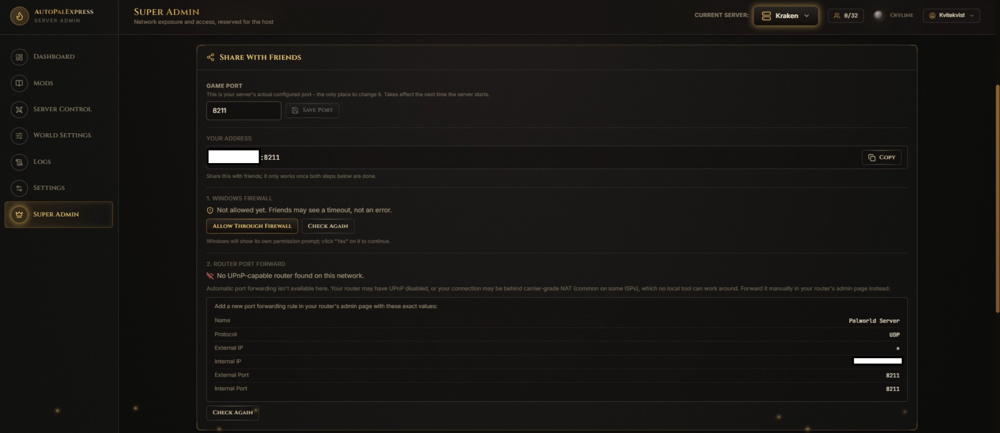
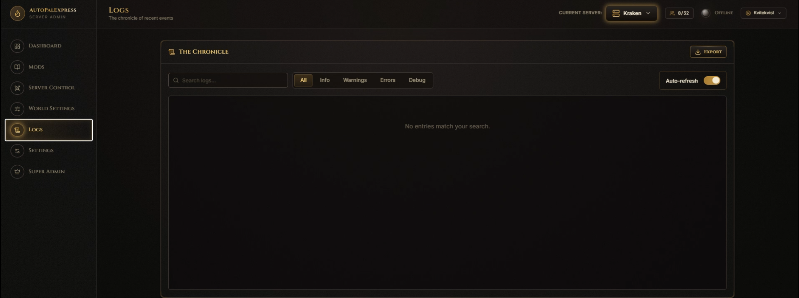
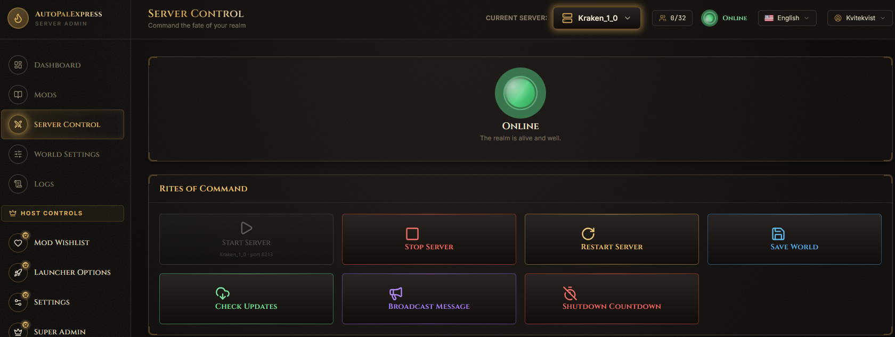
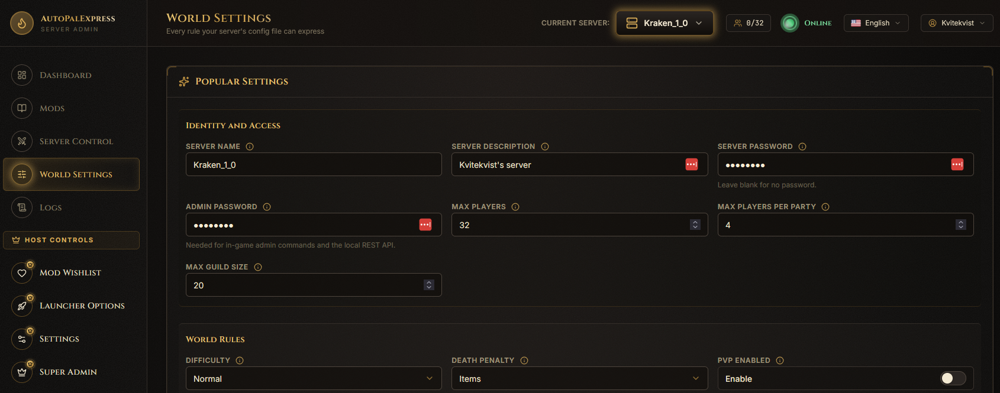

# AutoPalExpress

<p align="center">
  
  
  
  
</p>

**AutoPalExpress** is a Windows desktop app for running your own Palworld Dedicated Server without living in command windows, config files, firewall menus, and mod folders.

It opens in your browser, but it runs on your own PC. You stay in control of the server, while trusted friends can get their own admin accounts to help with day-to-day server tasks.



> [!IMPORTANT]
> AutoPalExpress is built for private servers and trusted friend groups. It is not meant to be exposed publicly to random users.

## Screenshots

| Dashboard | Mods |
| --- | --- |
|  |  |

| Super Admin | Logs |
| --- | --- |
|  |  |

| Server Control | World Settings |
| --- | --- |
|  |  |

> [!TIP]
> For a page-by-page walkthrough with screenshots of every sidebar page, see the [AutoPalExpress Wiki](https://github.com/Kvitekvist/AutoPalExpress/wiki).

## What It Helps With

If you just want to host a Palworld server for friends, AutoPalExpress handles the annoying parts:

- Start, stop, restart, and save the real Palworld server.
- Check for Palworld Dedicated Server updates and run SteamCMD upgrades after confirmation.
- Deploy a fresh dedicated server with SteamCMD.
- Import an existing server.
- Run multiple separate servers with their own folders, mods, and ports.
- Keep the server list unique when the same install is re-imported or restored.
- Switch servers, open a server folder in Explorer, unregister it, or unregister and delete its files.
- Choose where new server installs are stored, including another drive.
- Edit grouped World Settings from the browser, with aligned controls, guided dropdowns, and concrete low/high examples for common Palworld options.
- Manage Super Admin-only Launcher Options from their own sidebar page, including `-useperfthreads`, `-NoAsyncLoadingThread`, `-UseMultithreadForDS`, `-publiclobby`, and read-only Super Admin-derived `-publicip`/`-publicport` overrides.
- Start AutoPalExpress with Windows and bring the active server back online after a machine restart.
- Install and update UE4SS.
- Browse Nexus Mods without entering a personal API key.
- Install directly from Nexus once the super admin connects their Nexus Mods account through Nexus's own Single Sign-On - no key to copy or paste.
- Let regular admins add browsed mods, or updates to already-installed mods, to a per-server wishlist for the super admin to approve or deny.
- Show which installed mods have a newer version published on Nexus Mods.
- See a quiet in-app notice when a newer stable AutoPalExpress release is available on GitHub.
- Optionally show a small, understated donation link in the sidebar - never required, never intrusive.
- Enable, disable, reorder, and remove mods.
- View players, kick players, and ban players through Palworld's REST API.
- Monitor Dashboard CPU, RAM, players, uptime, and REST-backed server metrics.
- Schedule backups and restarts.
- Import a co-op or single-player world save from another PC straight into a server's save slot, with an automatic backup of whatever save was there before - no Steam install required on the server machine.
- Create invite codes so friends can help administer the server.
- Manage ports, Local API settings, Windows Firewall rules, public IP, and verified mod uploads from Super Admin.
- Run a bundled diagnostics command that checks the active server, local ports, firewall, REST API, and produces a support report.
- Switch the UI language from the top bar (English, Chinese Simplified, Japanese, German, French, Spanish) - each admin's choice is saved to their own account.

> [!TIP]
> The first account created becomes the super admin. Make sure that account belongs to the person hosting the server.

## Quick Start

1. Download `PalworldServerAdmin-Setup.exe` from the release page.
2. Run the installer.
3. Create the super admin account.
4. Deploy a new server or import one you already have.
5. Enable Windows startup recovery in Settings if you want the server to come back after Windows updates or power loss.
6. Open the Mods page to install UE4SS and manage mods.
7. Invite trusted friends if you want help running the server.

> [!TIP]
> New to the app? Follow the screenshot walkthrough in [Getting Started With AutoPalExpress](GETTING_STARTED.md).

> [!NOTE]
> The Palworld Dedicated Server downloads anonymously through SteamCMD. A Steam account is not required just to deploy the server.

> [!TIP]
> Run the same installer again to update or repair AutoPalExpress. If your existing app data is still present, setup keeps your server list and admin account and skips the first-time questions.

## Remote Access And Security

AutoPalExpress uses regular HTTP by default so setup can stay simple: no domain, certificate, reverse proxy, or manual browser-trust steps.

> [!CAUTION]
> If you port-forward the admin panel, login details and session cookies are not encrypted over the internet. Only invite people you trust, never post invite codes publicly, and do not treat the panel like a public website.

> [!TIP]
> For safer remote access, use something like Tailscale, ZeroTier, a VPN, or a reverse proxy with real HTTPS.

> [!WARNING]
> Do not port-forward Palworld's REST API port directly. AutoPalExpress talks to it locally on the server PC; friends should use the AutoPalExpress panel, not the raw Palworld REST API.

## Nexus Mods

AutoPalExpress browses Palworld mod metadata through Nexus Mods' public GraphQL API, so browsing does **not** require anyone to paste a personal Nexus API key.

AutoPalExpress also checks the repository's public GitHub Releases feed for newer stable versions. The check is cached for six hours, requires no GitHub account or token, and only shows a link to the official release page; it never downloads or runs an installer automatically.

> [!NOTE]
> Direct Nexus installs require the super admin to connect their Nexus Mods account through Nexus's Single Sign-On (opens a Nexus Mods tab to log in and approve AutoPalExpress) and requires Premium download access. Regular admins never connect anything directly: they can add mods (or updates to already-installed mods) to the server wishlist, and only the super admin's approval starts a download. Browsing still works without connecting anything.

If you do not use direct install, download files on Nexus Mods, then use **Install From File** in Super Admin. AutoPalExpress checks the uploaded file's exact hash against Nexus' catalog before installing it.

## Logs And Windows

The app intentionally leaves command windows visible:

- The AutoPalExpress console window shows the app running.
- The Palworld server window shows the dedicated server running.
- The Logs page shows AutoPalExpress output and server activity side by side.

> [!WARNING]
> Palworld's own server-window text cannot currently be mirrored into the browser. The game does not expose that text as normal stdout or a log file, so the real Palworld window stays visible separately.

## What Is Real

Most of the app is wired to the real machine and real server:

- Server process control is real.
- Server update checks and upgrades are real SteamCMD operations against the active server.
- Multi-server management is real.
- Server-instance cleanup is real: duplicate records are deduped by folder, normal Remove leaves files alone, and Remove and Delete deletes the registered server folder after the server is stopped.
- Fresh server deployments can use AutoPalExpress' default storage folder or a super-admin-selected install location.
- Launcher Options controls real per-server launch options: `-useperfthreads`, `-NoAsyncLoadingThread`, `-UseMultithreadForDS`, `-publiclobby`, and optional `-publicip`/`-publicport` overrides that read their values from Super Admin.
- Direct Nexus installs and verified manual file installs are real.
- Player roster, kick, and ban are real through Palworld's REST API, with the app normalizing Palworld's current player fields before showing the roster.
- If a server has REST enabled but an empty Admin Password, starting it through AutoPalExpress fills one in so REST-backed controls can authenticate.
- Dashboard CPU and RAM are read from the selected server's Palworld processes.
- Scheduled backups and restarts are real.
- Save Import is real: it copies an actual world-save folder onto disk into the server's save slot, after backing up whatever was there before.
- Windows startup recovery is real: the app can start at sign-in and restart the active server.
- World Settings edits the real `PalWorldSettings.ini`.
- Mods and UE4SS install to disk.
- Super Admin networking tools affect real ports and Windows Firewall rules.
- Logs show real AutoPalExpress output and real activity events.

<details>
<summary>Current limitations</summary>

- Whisper and teleport are shown as UI concepts only. Palworld's REST API does not provide per-player whisper or teleport commands.
- Stop/restart use Palworld's REST shutdown path first, then clean up the local Windows process if needed.
- The active server selection is shared by everyone using the panel.
- AutoPalExpress manages the UE4SS Mods folder, not Palworld's separate pak-mod system.
- Windows SmartScreen may warn because the installer is not code-signed yet.

</details>

## Installer Verification

After building a release, publish the SHA-256 checksum beside the installer so users can verify the file.

Current release build:

```text
SHA256  PalworldServerAdmin-Setup.exe  0CFC40030236ABF389A2F95D3BA5423670C83625C2004D2512B0AE8573F88759
```

> [!IMPORTANT]
> If the installer is rebuilt, the checksum changes. Update this section and `installer_output/CHECKSUMS.txt` after every release build.

## For Developers

<details>
<summary>Run from source</summary>

```bash
python -m venv .venv
# Windows PowerShell:
# .venv\Scripts\Activate.ps1
pip install -r requirements.txt
python Palworld_Server.py
```

Run the frontend separately in development:

```bash
cd web
npm install
npm run dev
```

The Vite dev server proxies `/api/*` to the backend.

</details>

<details>
<summary>Build the Windows installer</summary>

```text
scripts\build.bat
```

Or run the underlying PowerShell script directly:

```powershell
.\build_installer.ps1
```

Both build the frontend, package the backend with PyInstaller, and compile the installer with Inno Setup 6.

Outputs:

- `dist/PalworldServerAdmin.exe`
- `installer_output/PalworldServerAdmin-Setup.exe`

</details>

## Where Data Is Stored

When installed, app data is stored under:

```text
%LOCALAPPDATA%\PalworldServerAdmin\data
```

This includes server registry data, users, sessions, invites, and mod records.

## Support

If something does not work and you are not sure why, run **Diagnose AutoPalExpress** from the Start Menu. It checks the active server setup, Palworld files, local game port, Windows Firewall, REST API access, and writes a report to:

```text
%LOCALAPPDATA%\PalworldServerAdmin\diagnostics
```

If the report says local checks passed but outside players still cannot connect, the remaining cause is usually router forwarding, double NAT/CGNAT from the ISP, the wrong public IP, or an upstream firewall.

Use the GitHub issues page or the release/community post where you found the download.
