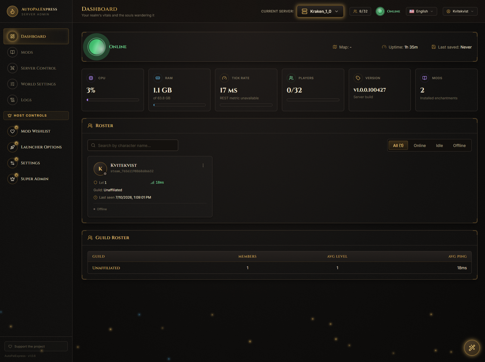
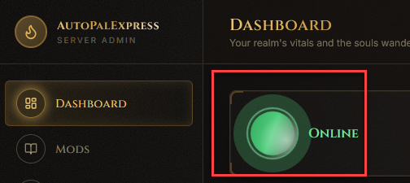
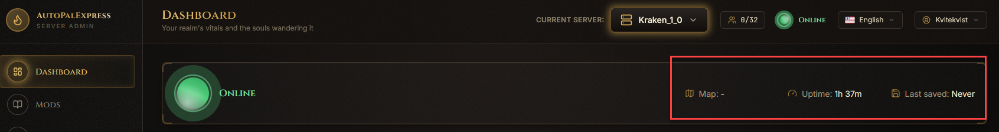
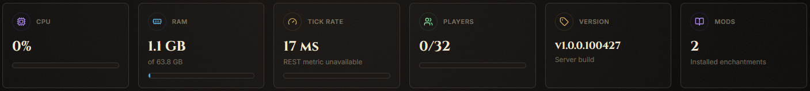
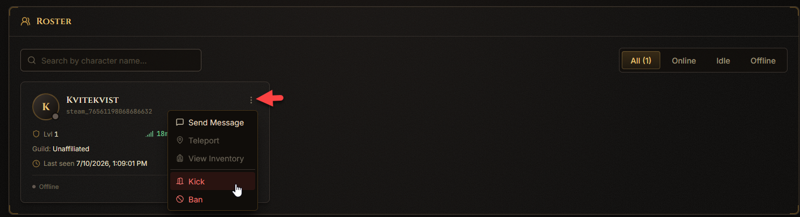
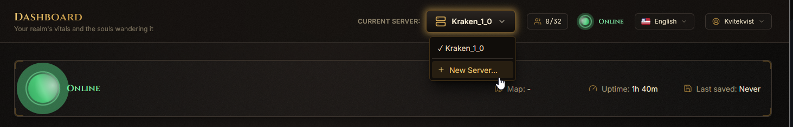

# Dashboard

This is the first page you see after logging in. It tells you, at a glance, whether your server is running and who's on it.

## How do I know if my server is online?

Look at the big glowing icon at the top of the page. Under it, the text says **Online**, **Offline**, **Starting**, **Stopping**, or **Restarting**.

Next to it you'll see three quick facts: the **Map** you're playing on, how long the server has been **Up**, and when it was **Last saved**.

## How do I check server performance?

The row of tiles below the status shows **CPU**, **RAM**, **Tick Rate** (how smoothly the server is running), **Players**, server **Version**, and how many **Mods** are installed.

If CPU or RAM looks maxed out, or Tick Rate is far from its target, that usually means the server is struggling - consider fewer mods or a more powerful PC.

## How do I kick or ban a player?

Scroll down to the player list. Each connected player has a row with **Kick** and **Ban** buttons next to their name.

> Kicking removes them for now; they can rejoin. Banning keeps them out until you unban them.

## "No server is set up yet" banner

If you haven't deployed or imported a server, you'll see a banner near the top with a link.

Click that link - it takes you to [Settings](settings.md), where you can create a brand-new server or import one you already have.
