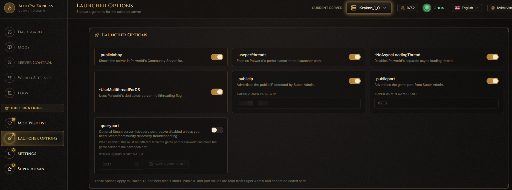
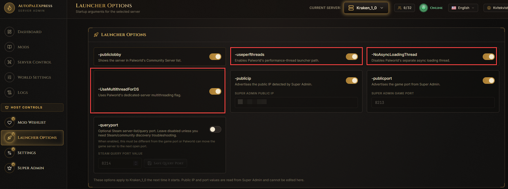
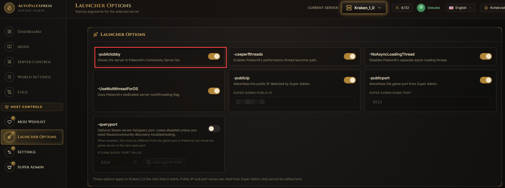
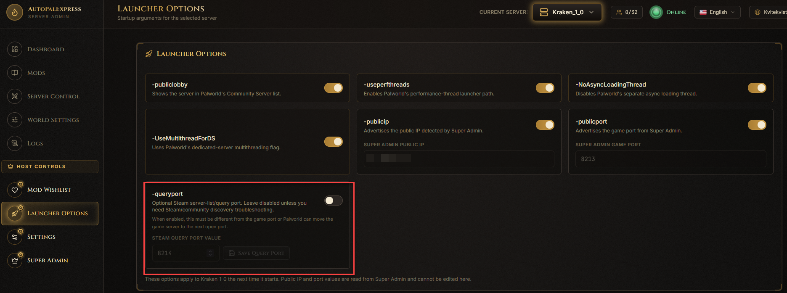
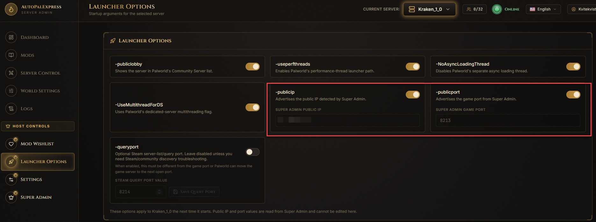

# Launcher Options

*Only the super admin sees this page, under Host Controls in the sidebar.*

This page controls the extra startup flags Palworld's server is launched with.

*(Screenshot placeholder - a full view of the Launcher Options page)*

## How do I turn on performance flags?

Flip the toggles for the performance options (`-useperfthreads`, `-NoAsyncLoadingThread`, `-UseMultithreadForDS`) if your server is struggling with performance.

*(Screenshot placeholder - circle the three performance toggles)*

## How do I make my server show up in Palworld's public server list?

Turn on the **Community Server** toggle (`-publiclobby`).

*(Screenshot placeholder - circle the Community Server toggle)*

## How do I use a separate query port?

Turn on **Query Port**, then set a port number. Only do this if you specifically need it - it defaults to off, and AutoPalExpress keeps it separate from your game port automatically to avoid a known conflict.

*(Screenshot placeholder - circle the Query Port toggle and its port number field)*

## How do I override my public IP or port for the community list?

Turn on the override toggles here - the actual values still come from [Super Admin](super-admin.md), so you only ever set the real IP/port in one place.

*(Screenshot placeholder - circle the public IP and public port override toggles)*

> Restart the server after changing anything on this page - launch options only apply on the next start.
