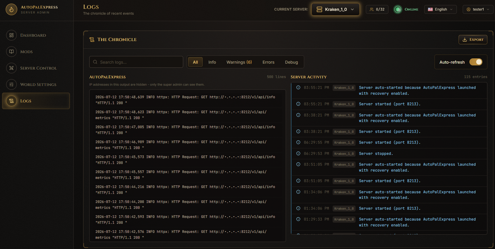
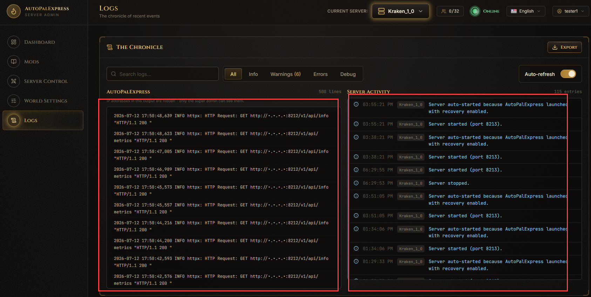
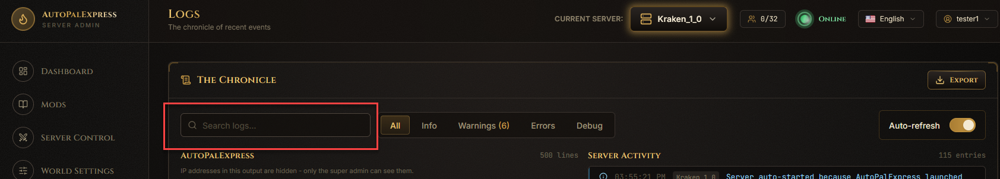
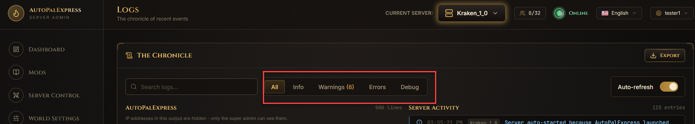
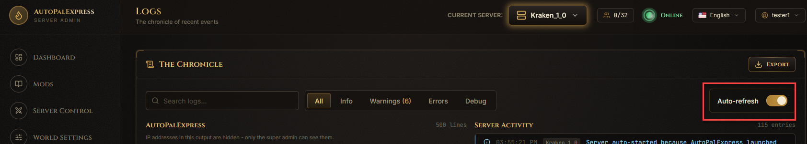
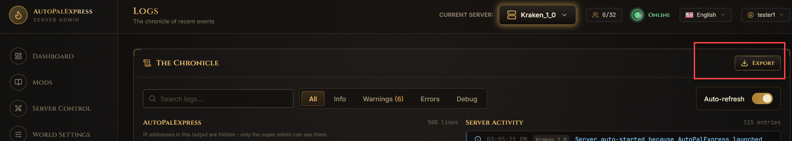

# Logs

This page shows you what's been happening - both AutoPalExpress's own activity and real events from your Palworld server.

*(Screenshot placeholder - a full view of the Logs page with both panels side by side)*

## What am I looking at?

The left panel, **AutoPalExpress**, is the app's own output - useful if the admin panel itself is acting up. The right panel, **Server Activity**, shows real events like joins, leaves, saves, and warnings.

*(Screenshot placeholder - circle both panel headers so it's clear which is which)*

## How do I find something specific?

Type into the search box at the top - it filters both panels as you type.

*(Screenshot placeholder - circle the search box)*

## How do I only see warnings or errors?

Use the **All / Info / Warnings / Errors / Debug** tabs above Server Activity to filter by level.

*(Screenshot placeholder - circle the level filter tabs, especially Warnings and Errors)*

## How do I stop the page from constantly refreshing?

Flip the **Auto-refresh** switch off if you want the log to stay still while you read it.

*(Screenshot placeholder - circle the Auto-refresh toggle)*

## How do I send my logs to someone for help?

Click **Export** at the top of the page - it downloads both logs as one text file you can attach when asking for help.

*(Screenshot placeholder - circle the Export button)*

> Only the super admin can see real IP addresses in the AutoPalExpress panel - regular admins see them masked out.
