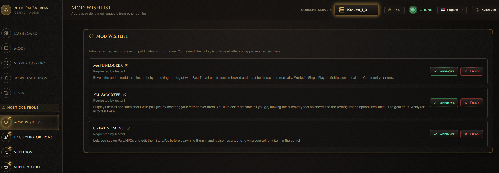
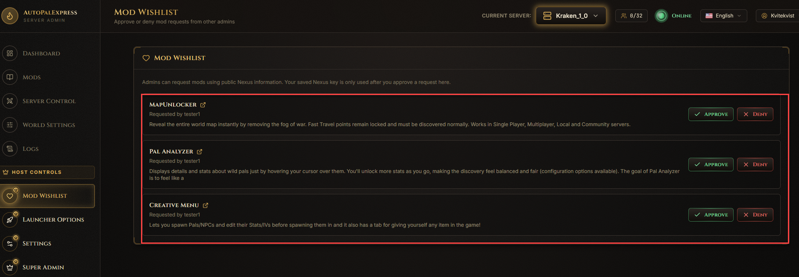
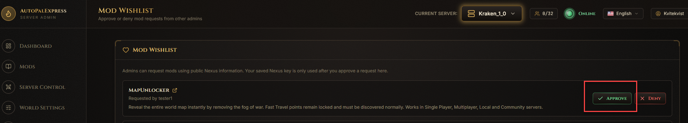
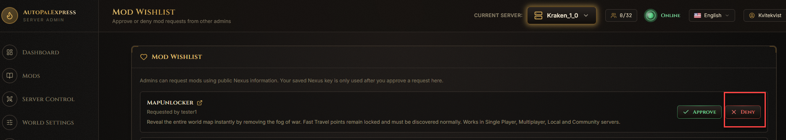

# Mod Wishlist

*Only the super admin sees this page, under Host Controls in the sidebar.*

This is where you approve or deny mods that other admins have asked for.

*(Screenshot placeholder - a full view of the Mod Wishlist page with at least one pending request)*

## How does a mod end up here?

Regular admins browse mods from the [Mods](mods.md) page. If direct install isn't available to them, they click **Add to Wishlist** instead, which adds it to this list for you to review.

*(Screenshot placeholder - circle a pending request row, showing the mod name and who requested it)*

## How do I install a requested mod?

Click **Approve** on that request. This uses your saved Nexus Premium key to download and install it - the requesting admin never touches that key themselves.

*(Screenshot placeholder - circle the Approve button on a request)*

## How do I turn down a request?

Click **Deny**. It's removed from the list with nothing installed.

*(Screenshot placeholder - circle the Deny button on a request)*

> If the same mod gets requested again, duplicate requests are automatically suppressed - you won't see repeats piling up.
