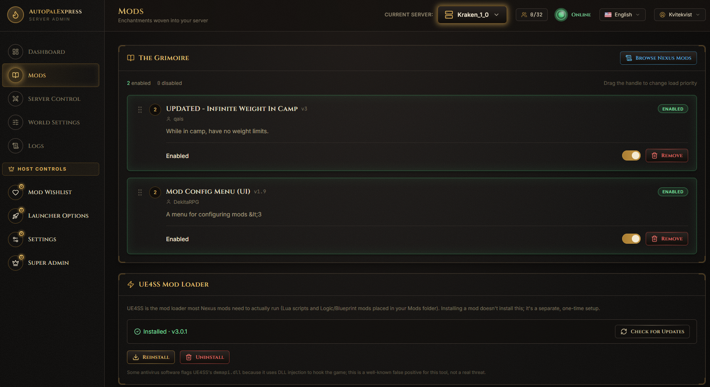
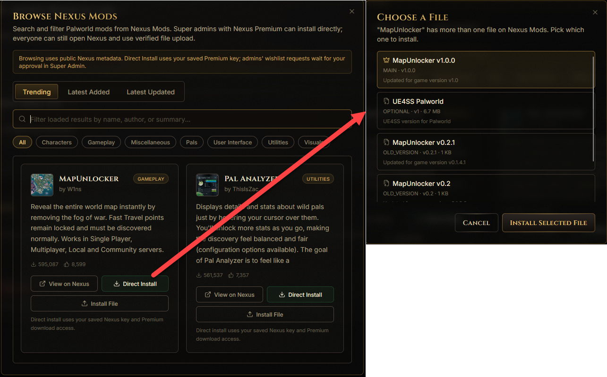
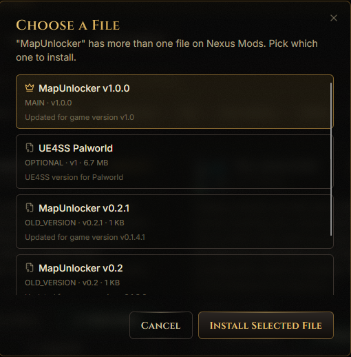
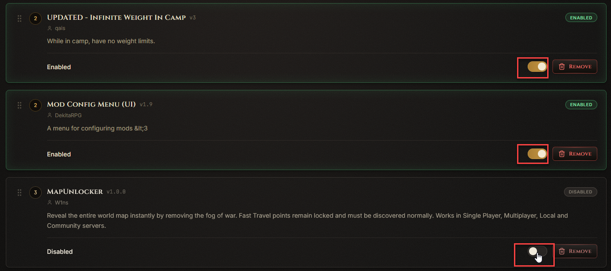
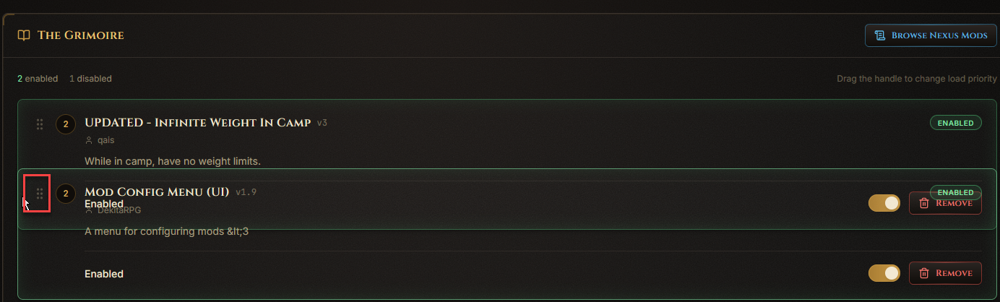
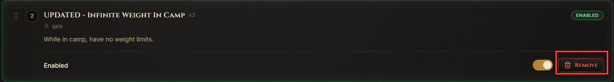
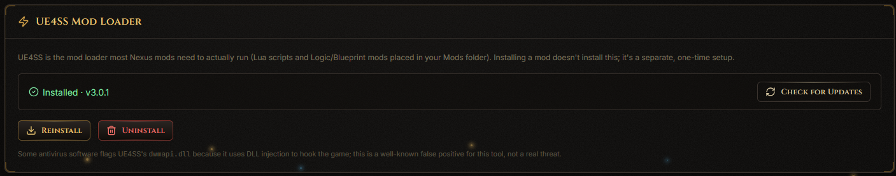

# Mods

This page is where you install, enable, disable, and remove mods for your server.

## How do I browse for new mods?

Click **Browse Nexus Mods** at the top right of the page. This opens a search window where you can look through Palworld mods on Nexus Mods - no account or API key needed just to browse.

## How do I install a mod I found?

In the browse window, every mod has an **Add to Wishlist** button - this applies to admins and the super admin alike. This sends a request to the super admin, who can approve it from the [Mod Wishlist](mod-wishlist.md) page.

If a mod has more than one file to choose from (like a Main File and some Optional Files), you'll see a small picker so you can choose exactly which one you want.

## How do I turn a mod on or off?

Every installed mod has a toggle switch on its card. Flip it to enable or disable that mod without removing it.

## How do I change which mods load first?

Each mod card has a drag handle. Click and drag it up or down to change that mod's load priority.

## How do I update or remove a mod?

If an update is available, an **Update** button appears on that mod's card. To remove a mod entirely, use the **Remove** button and confirm in the popup.

## How do I install UE4SS?

Scroll to the bottom of the page for the UE4SS panel. This is required for most Lua-based mods to work.

> Restart the server any time you change mods, so Palworld picks up the change.
