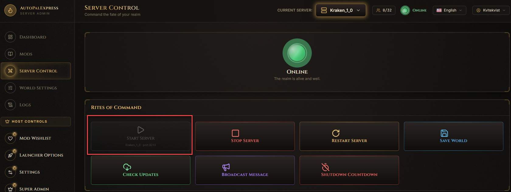
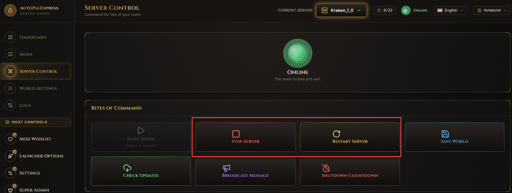
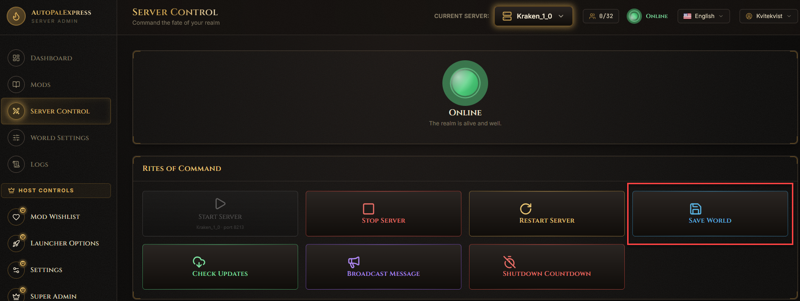
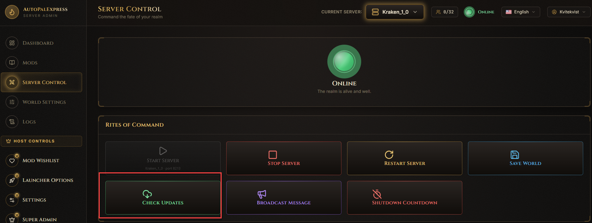
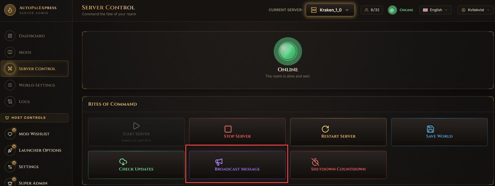
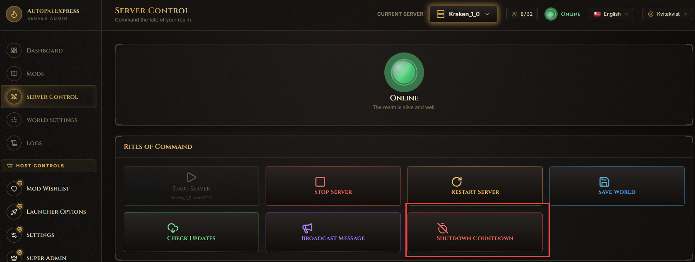

# Server Control

This is where you turn the Palworld server on and off, and send commands to it while it's running.

## How do I start my server?

Click the big **Start Server** tile. If you manage more than one server, click **Change** in the corner of that tile first to pick which one you're starting.

## How do I stop or restart it?

Click **Stop Server** or **Restart Server**. Either way, you'll get a confirmation popup first, since this disconnects everyone currently playing.

## How do I save the world without restarting?

Click **Save World**. This forces an immediate save without taking the server offline.

## How do I update Palworld itself?

Click **Check Updates**. If Steam has a newer version, you'll be asked to confirm before it updates - this only works while the server is stopped.

## How do I message everyone on the server?

Click **Broadcast Message**, type your text, and send it. It appears instantly for every connected player.

## How do I schedule a shutdown instead of stopping immediately?

Click **Shutdown Countdown**, pick a delay (30 seconds up to 5 minutes), and confirm. Players stay connected until the timer runs out.

