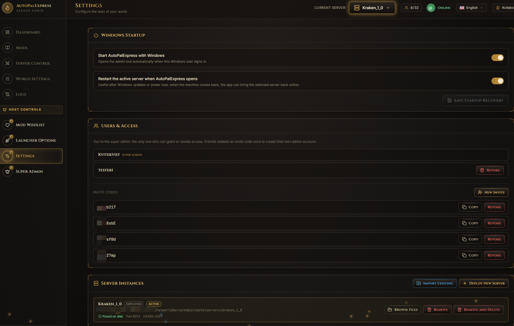
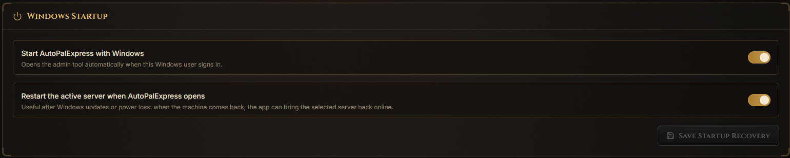
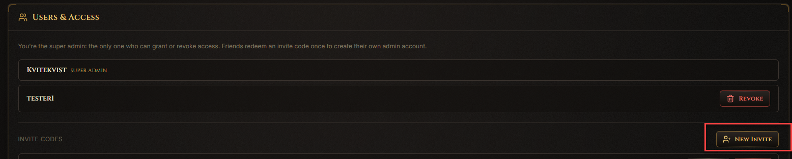
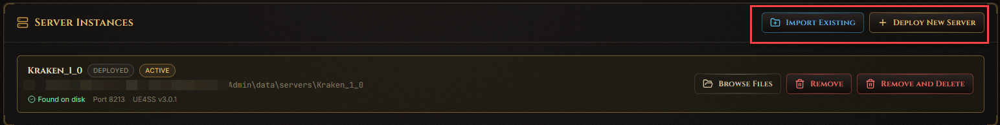
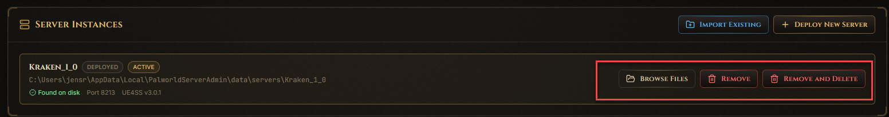
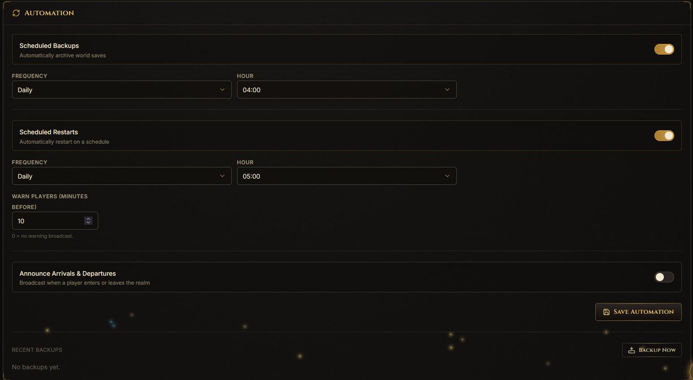

# Settings

*Only the super admin sees this page, under Host Controls in the sidebar.*

This page manages your servers, your admins, backups, and startup behavior.

## How do I make the server come back after a PC restart?

In the **Startup Recovery** panel, turn on starting AutoPalExpress with Windows, and auto-starting the active server.

## How do I invite a friend to help admin the server?

In the **Users** panel, click **Generate Invite Code**. Share that code with your friend - they use it to register their own account.

> Only invite people you trust. Regular admins can't touch the dangerous stuff (ports, server folders, mods folder, startup) - that stays locked to you.

## How do I add another server?

In the **Server Instances** panel, click **Deploy New Server** to create one from scratch, or **Import Existing** if you already have server files somewhere.

## How do I switch, open, or delete a server?

Each server in the list has its own menu with **Switch To**, **Browse Files**, **Remove**, and **Remove and Delete**.

> "Remove" just un-lists it - your files stay untouched. "Remove and Delete" actually deletes the server folder, and only works while that server is stopped.

## How do I schedule automatic backups?

In the **Automation** panel, set up your backup and scheduled restart times.

