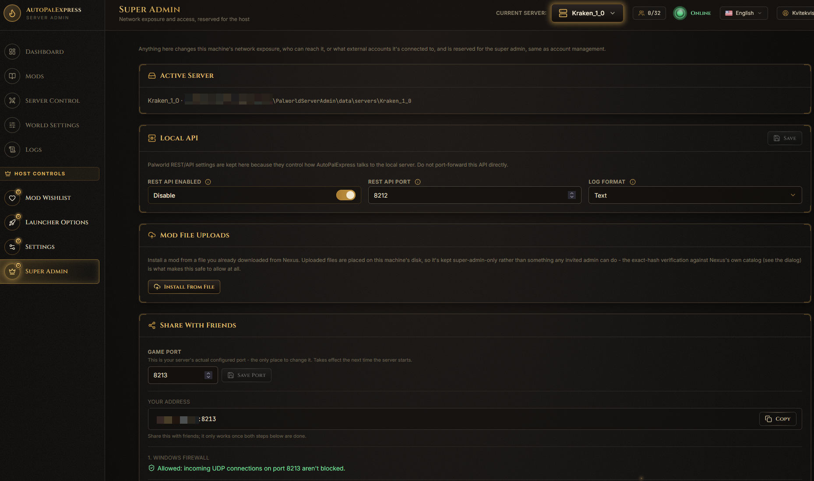
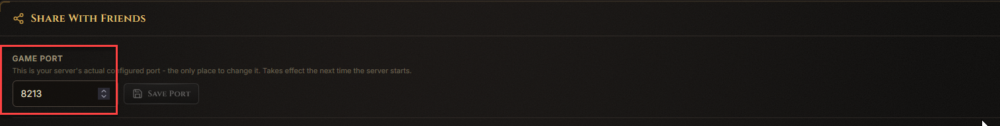
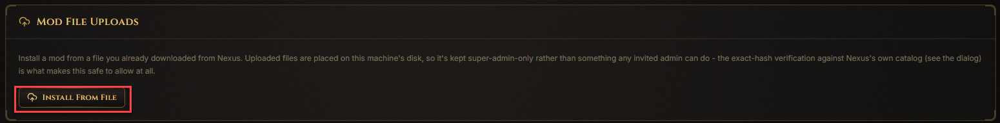
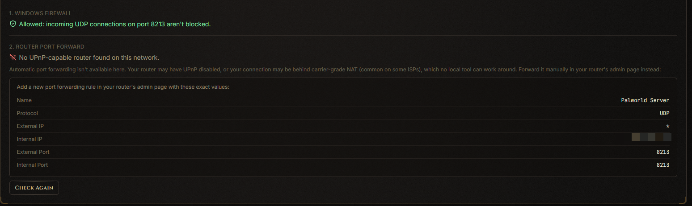
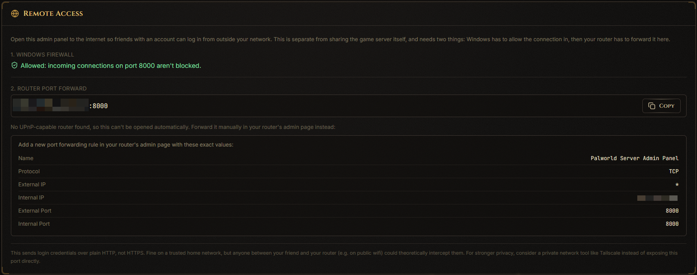
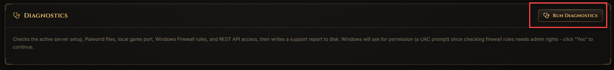
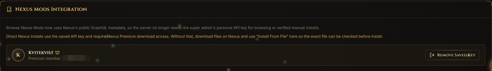

# Super Admin

*Only the super admin sees this page, under Host Controls in the sidebar.*

This page controls anything that touches your network, your firewall, or outside accounts like Nexus Mods.

## How do I find my Game Port? (needed to let friends join)

Look at the **Active Server** panel near the top - it shows the server's folder and its real game port.

## How do I install a mod file I already downloaded myself?

Click **Install From File** in the **Mod File Uploads** panel, then choose the file. AutoPalExpress checks it against Nexus's own catalog before installing, so you know it's the real, unmodified file.

## How do I open my server to friends over the internet?

In the **Port Forwarding** panel, click **Forward** to let AutoPalExpress try to open the port automatically through your router (UPnP). If that doesn't work, the panel shows the exact values to enter manually in your router's settings.

## How do I set up remote access to the admin panel itself?

Use the **Remote Access** panel to expose AutoPalExpress's own web page beyond your home network.

> This uses plain HTTP by default. For anything beyond a small trusted group, consider Tailscale, ZeroTier, a VPN, or a reverse proxy with real HTTPS instead.

## How do I check why something isn't working?

Click **Run Diagnostics** in the **Diagnostics** panel. It checks your server folder, ports, firewall, and REST API, then shows a report right on the page.

## How do I connect my Nexus Premium account?

In the **Nexus Integration** panel, paste your Nexus API key and click **Connect**. This enables one-click direct installs on the [Mods](mods.md) page and lets you approve [Mod Wishlist](mod-wishlist.md) requests.

