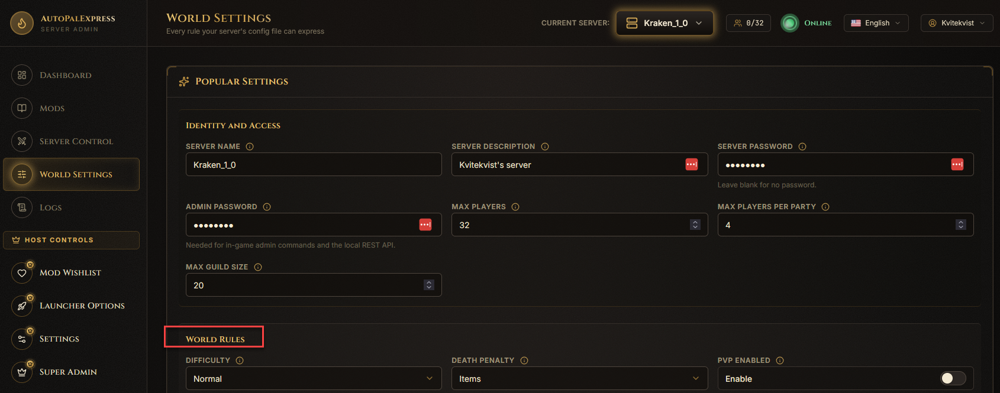
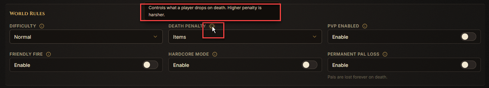
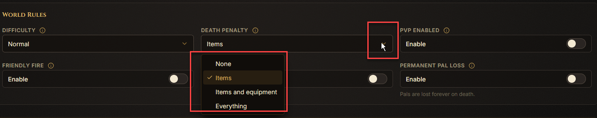
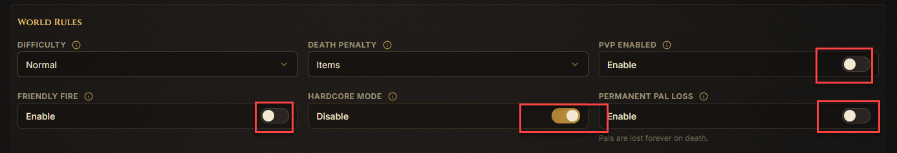
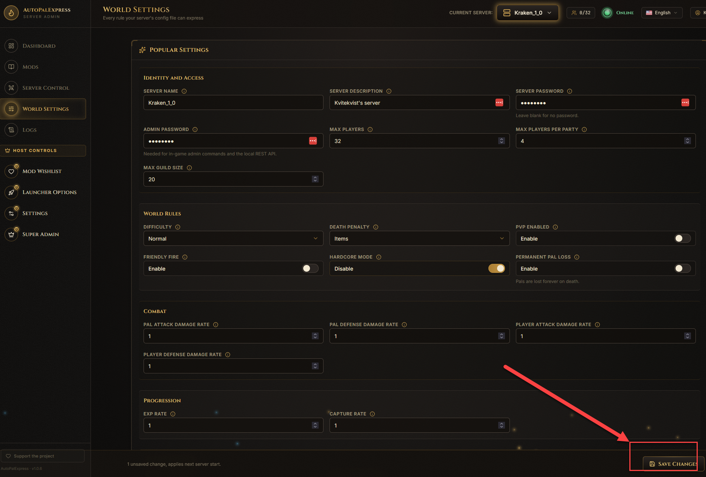

# World Settings

This page changes the actual rules of your Palworld world - the same things you'd normally edit by hand in a config file.

## How do I find a specific setting?

Settings are grouped into labeled sections like **Identity and Access**, **World Rules**, **Combat**, **Progression**, **Time and Survival**, and more. Scroll through the section headers to find the one you want.

## How do I know what a setting actually does?

Hover over the small info icon next to any field's name. It shows an explanation, plus example values (like "10 is low, 30 is normal, 60+ is high") so you're not guessing.

## How do I change a setting like Difficulty?

Some settings show a dropdown with a fixed list of choices instead of a text box - pick one from the list.

## How do I turn a setting on or off?

Boolean (yes/no) settings show as a labeled box reading **Enable** or **Disable**. Click it to flip it.

## How do I save my changes?

Click **Save Changes** at the top or bottom of the page.

> Restart the server afterward - Palworld only picks up World Settings changes on the next start.

## Where do I change the game port or public IP?

Those live elsewhere on purpose, so there's only one place to edit them: the game port is on [Super Admin](super-admin.md), and public IP/port overrides are on [Launcher Options](launcher-options.md).
